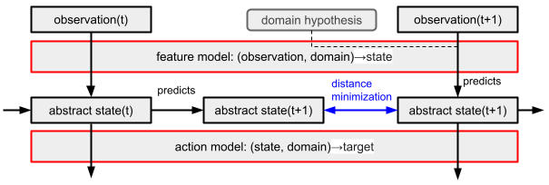

## Breaking Free from the Stability-Plasticity Dilemma with Domain Identification

Arxiv link: soon

I make the case for identifying the input domain prior to running the main model and propose
an architecture that opens the door to single-head continual learning (CL) systems that forget
at a decreasing rate as the tasks grow in complexity.
The proposed model accurately identifies domains and is compatible with other CL algorithms,
provided they benefit from knowing the current domain beforehand.

### Catastrophic forgetting

A common approach to overcoming catastrophic forgetting is to replay data,
either by storing the training samples or by training a model to randomly generate training samples.

Since replay is expensive memory-wise and computation-wise, new methods have been developed to
mitigate catastrophic forgetting, e.g. EWC.

These methods face a dilemma: the more flexible the weights are, the more likely the model will forget.
Conversely, the more stable the weights are, the more difficult it is for the model to fit new data.
In practice, under this paradigm, there seems to be no tradeoff suitable for training models over
very large time scales, and there is no promising sign hinting that the stability-plasticity
tradeoff can become more favorable as we tackle harder tasks with larger models.
This is in stark contrast with the success of deep learning, which has shown that scaling up
networks can help achieve human-level performance on some tasks.

### Prior domain knowledge

I argue that approaches relying on knowing the domain perform better than abovementioned methods,
but they are often dismissed on the basis that knowing the domain beforehand is not a realistic scenario.
*Prima facie*, this is a valid criticism since domain and task labels are normally not available during inference,
and predicting domain labels using a dedicated model is a problem of the same nature and same difficulty as class incremental-learning.

I propose to solve this problem by having the system detect discrepancies at the abstract level,
ruling out domains that cause discrepancies.

The abstract level is the last layer of the feature processors.
At this level, the values of the units no longer depend on the input domain.
Granted the processors are trained to produce consistent abstractions,
as in the algorithm section, the abstract representation of an ice-cream truck
seen on a rainy day will be identical to its representation on a sunny day,
despite contextual differences.

This domain-invariance property of abstraction allows the system to make
some predictions without already knowing the domain, thereby breaking the
vicious circle of trying to implement CL by relying on information that
is at risk of being catastrophically forgotten,
unless it is delivered by yet another CL system.

The main advantage of the proposed method is that discrepancies are
easier to detect on wide abstraction layers,
insofar as they do not include redundant units.
To avoid redundancy, the abstraction layer should be sized in
proportion to the complexity of the tasks at hand. In other words,
as we tackle more complex tasks, we can scale up our models and
their abstraction layer, which in turn lowers the likelihood of catastrophic forgetting.

### Architecture

<p align="center">
  
</p>


The proposed architecture requires future abstract states to be predictable by current abstract states.
As a consequence, observations and targets have to be of a sequential nature.
This includes text, time series, video and reinforcement learning.

In this architecture, the state at time T+1 is predicted by two entities.

- a model or a program called `Center` that predicts the next state from the current state
- a feature processor `P` that predicts the next state from observations alone.

These two predictions will conflict.
We resolve conflicts by choosing the domain hypothesis under which `P` agrees the most with `Center`,
typically by minimizing the distance between Center’s prediction and P’s prediction
under the constraint that Center’s prediction is fixed.

As a special case of this architecture,
we will build `P` as a collection of non-overlapping neural networks P[1], P[2]…P[n].
Each neural network is trained to process a different domain.
While this simplifies the training algorithm and allows the system to instantiate domain-specialized networks,
it is memory inefficient and misses on the opportunity to mutualize knowledge between domains.
It should be noted, however, that soft-parameter sharing and pruning can mitigate these issues.

### Algorithm

Below, `A` will denote the Action network mapping abstract states to targets.

#### Loss functions

- `l1`: Target prediction loss, e.g. cross-entropy
- `l2`: Abstract state prediction loss: `AVG || Center(P[d](Obs_t)) - P[d](Obs_t+1)  ||`   
- `l3`: State amplitude to compensate for `l2`’s tendency to push amplitude downwards: `1 - AVG || Tanh(P[d](Obs_t)) ||`


#### Training

- On a small number of arbitrary domains, train `P[0]` conjointly with `A` and `Center`, minimizing `l1+l2+l3`.
- Freeze `P[0]` and `A`.
- Fine-tune `Center` with `l2`.
- Freeze `Center`.
- For each new domain `D`, train a new processor `P[D]` minimizing `l1+l2`.

It is worth noting that `A` and `Center` are not continually trained.
Therefore, they do not suffer from catastrophic forgetting.

#### Inference

- Predicts state `S_t+1` from `S_t` using `Center`.
- Pick domain such as `D = min_d || P[d](O_0 … O_t+1) - Center(S_t) ||` where `O_t+1` is the observation at time `t+1`.
- Set `S_t+1 = P[D](O_t+1)`
- Predict the target `T_t+1 = A(S_t+1, D)`

### Results

I will showcase the architecture with a language model trained on a
[dataset of cooking recipes](https://eightportions.com/datasets/Recipes/#fn:1).

Words of the recipes are randomly mapped to an integer between 0 and 4096 using a hash function.
We create 7 domains by randomly permuting the mapping between words and indices,
and bootstrap most of the architecture, including the abstraction layer, from one domain only.
It is essentially the NLP version of Permuted MNIST.

Feature processors are implemented as masked convolution networks.
`Center` and `A` are implemented as multi-layer perceptrons.


| size of the abstraction layer        | 16     | 32     | 48     |
|--------------------------------------|--------|--------|--------|
| domain identification error rate     | 7.01%  | 2.32%  | 0.63%  |
| LM accuracy                          | 51.19% | 57.15% | 58.46% |
| Average probability of expected word | 0.41   | 0.45   | 0.46   |

As you can see, the domain identification error rate plummets as we
increase the size of the abstraction layer.
From size=16 to size=32, it is divided by 3.
From size=32 to size=48, it is further divided by 3.7.

The accuracy of the language model doesn’t significantly increase as the abstraction layer gets wider.
In this instance, this goes to show that the measured domain identification error rate is not a mere
consequence of increasing the main accuracy.

## Limitations and future work
### Biological plausibility

This architecture falls short of being biologically plausible on many levels but it does exhibit some
properties which are speculated to be key characteristics of brains.

- In addition to traveling from sensory inputs to abstract representations (bottom up),
the flow of information also goes from abstract representations to sensory input processors (top down).
- The way `Center` connects `state(t)` and to `state(t+1)` paves the way for new architectures
where abstract representations would have an unambiguous causal power on the next states.

### Domain boundaries at training

The algorithm section assumes that domains are known at training time.
Since it is possible to identify domains during inference,
one can utilize a similar process and a distance threshold to detect unknown domains.

The remaining unsolved problem is to detect when two unknown domains are the same.

### Task diversity

`Center` and `A` are frozen after training.
This is suitable for domain incremental learning but doesn’t leave any room for new abstractions and new targets.
It is worth considering relaxing the constraints imposed by the frozen networks and letting processors add new abstractions.
This will require replacing `Center` with a continually trained model.
We are not finding ourselves in the same vicious circle as the one we started with though,
as abstract representations have a known, controllable shape and occupy significantly less storage space than raw sensory inputs.

### Dynamic state matching

In my implementation, `Center`'s predictions and `P`'s predictions are compared with one another via a simple Euclidean distance.
Since we work under the assumption that `Center`'s prediction is always right, one can improve the domain inference algorithm by allowing `P` to temporarily nudge its weights to better match with `Center`'s prediction.
Instead of minimum Euclidean distance, the criterion becomes the minimum change of weights required to align both predictions.


## How to replicate the results

Download and unzip [recipes_raw.zip](https://storage.googleapis.com/recipe-box/recipes_raw.zip).

Run the following commands.

```bash
python3 eval_lm.py 16 recipes_raw_nosource_ar.json
python3 eval_lm.py 32 recipes_raw_nosource_ar.json
python3 eval_lm.py 48 recipes_raw_nosource_ar.json
```

Repeat this procedure a handful of times and collect the results in your working directory.
- domain_accuracy.txt
- LM_accuracy.txt
- LM_target_proba.txt


Tested on Ubuntu 20.04 with versions:

| name    | version |
|---------|---------|
| cuda    | 11.2    |
| python  | 3.8.5   |
| torch   | 1.9.0   |
| numpy   | 1.21.0  |
| tqdm    | 4.61.1  |
| mmh3    | 3.0.0   |
